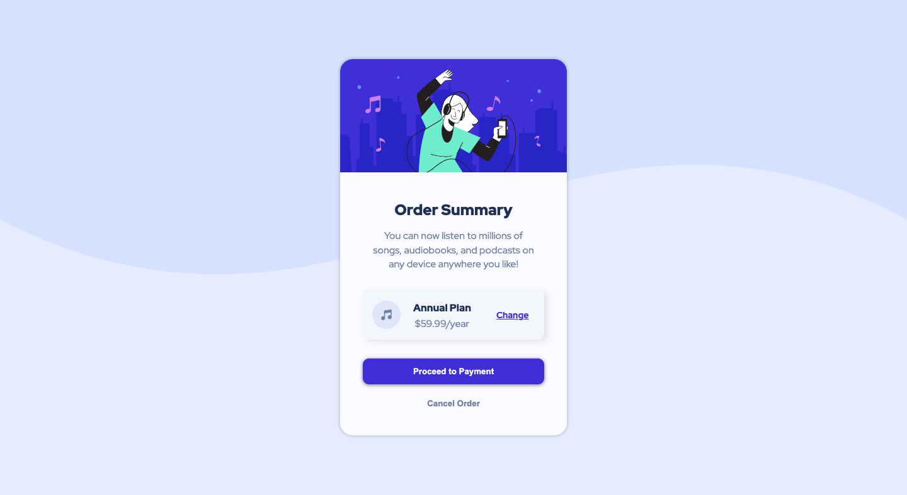

# Frontend Mentor - Order summary card solution

This is a solution to the [Order summary card challenge on Frontend Mentor](https://order-summary-card0.netlify.app/).

## Table of contents

- [Screenshot](#screenshot)
- [Links](#links)
- [My process](#my-process)
  - [Built with](#built-with)
- [Author](#author)

### Screenshot

### Links

- Solution URL: [Github code source ](https://github.com/steeven509/order-summary-card)
- Live Site URL: [Add live site URL here](https://order-summary-card0.netlify.app/)

## My process

### Built with

- Semantic HTML5 markup
- CSS custom properties
- Flexbox
- SASS

## Author

- Frontend Mentor - [@steeven509](https://www.frontendmentor.io/profile/steeven509)
- Linkedin - [@steeven cadeau](https://www.linkedin.com/in/steeven-cadeau-049433194/)
